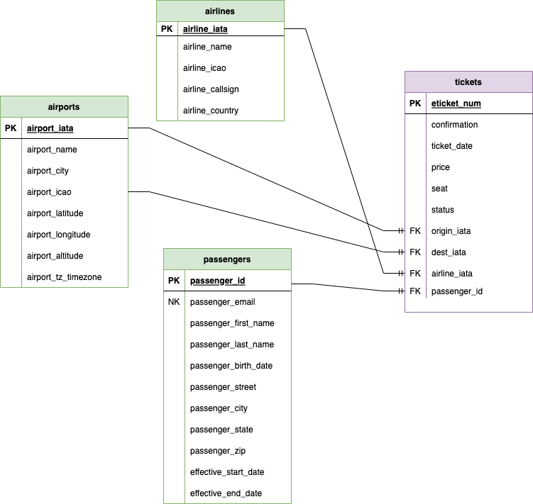

# Code Review: Data Modeling

#### By Drew White

#### Code Review - Demonstrating the use of Data Modeling through dimension and fact diagrams and doing an ETL pipeline with that information. 

## Technologies Used

* Google Cloud
* Big Query
* Draw.io
* SQL
* Python
* Pandas
* Jupyter Notebooks
* Data Modeling

</br>

## Description:
Inspect our main tickets source file: [`data/air_travel/tickets.json`](./data/air_travel/tickets.json)

This file include json row records. Each record includes an issued flight ticket such as:

```json
{
  "eticket_num": "498-938211-0795",
  "confirmation": "ZVFDC4",
  "ticket_date": "2022-03-23",
  "price": 723.42,
  "seat": "31I",
  "status": "active",

  "airline": {
    "name": "China Eastern Airlines",
    "iata": "MU",
    "icao": "CES",
    "callsign": "CHINA EASTERN",
    "country": "China"
  },

  "origin": {
    "name": "Montreal / Pierre Elliott Trudeau International Airport",
    "city": "Montreal",
    "country": "Canada",
    "iata": "YUL",
    "icao": "CYUL",
    "latitude": 45.47,
    "longitude": -73.74,
    "altitude": 118,
    "tz_timezone": "America/Toronto"
  },

  "destination": {
    "name": "Chicago Midway International Airport",
    "city": "Chicago",
    "country": "United States",
    "iata": "MDW",
    "icao": "KMDW",
    "latitude": 41.79,
    "longitude": -87.75,
    "altitude": 620,
    "tz_timezone": "America/Chicago"
  },

  "passenger": {
    "first_name": "Robert",
    "last_name": "Brown",
    "gender": "M",
    "birth_date": "1969-02-17",
    "email": "robert.brown.69@hotmail.com",
    "street": "5007 Thomas Way",
    "city": "Lake Hollystad",
    "state": "DC",
    "zip": "20027"
  }
}
```

<br><br>


## Exercise 1: Data Modeling

Using draw.io create a data model. Your data model MUST meet the following requirements:

1. Contain a _tickets_ fact table
1. Contain the following dimensions: _airlines_, _airports_, and _passengers_
1. Develop _passengers_ as an SCD Type2 dimension:
    - Passenger email can be used as the natural key
    - Be sure to add a surrogate key and effective start/end dates
    - You can optionally add an active column
1. IATA codes can be used as the primary key for both _airlines_ and _airports_
1. Use the t-ticket number as the primary key for the _tickets_ fact

  
_Data model created as outlined in exercise. Using [`data/air_travel/tickets.json`](./data/air_travel/tickets.json)_
<br><br>

## Exercise 2: Data Loading and Normalization

Develop an ETL pipeline that loads our dimensions and facts from the source file. You pipeline MUST meet the following requirements:

**General**:
- Load all dimensions in order: _airlines_, _airports_, and _passengers_
- Load the _tickets_ fact table after loading dimensions
- Your pipeline can drop/replace tables
- You can assume only inserts at this state. No updates, deletes, or merges

**Airlines Dim:**
- Identify unique airlines
- Use IATA code as the dimension key

**Airports Dim:**
- Identify unique airports from both origin and destination fields
- Use IATA code as the dimension key

**Passengers Dim:**
- Identify unique passengers
- Use the passenger email as the dimension natural key
- Generate UUIDs for the dimension surrogate keys
- Set the effective start date to any date. You can either use the ticket date, current date, or a fixed set date in the past
- Set the effective end date to None
- Optionally set your active flag to 'Y'
- Passenger address columns are considered SCD Type 2 columns
- All other columns are SCD Type 1

**Tickets Fact:**
- Link to _airlines_ and _airports_ dimensions by their IATA codes. 
- You don't need a lookup for _airlines_ and _airports_ since we use their IATA as dimension keys
- Link to the _passengers_ dimension by its surrogate key
- You need to perform a lookup to the _passengers_ dimension
- Load all the tickets

<br><br>

## Setup/Installation Requirements

* Clone by inputting following into terminal: 
  ```bash
  git clone https://github.com/Drewrwhite/data_week_8.git
  ```
* Navigate to directory:
  ```bash
  cd <directory>
  ```
* Create a virtual environment:
  ```bash
  python3.7 -m venv venv
  ```
* Activate virtual environment:
  ```bash
  source venv/bin/activate
  ```
* Install requirements:
  ```bash
  pip install -r requirements.txt
  ```
* Open directory in VSCode:
  ```bash
  code .
  ```
</br>

## Known Bugs

* No known bugs

<br>

## License

[MIT](./license.txt)

_If you find any issues, please reach out at: **d.white0002@gmail.com**._

Copyright (c) _2023_ _Drew White_

</br>
